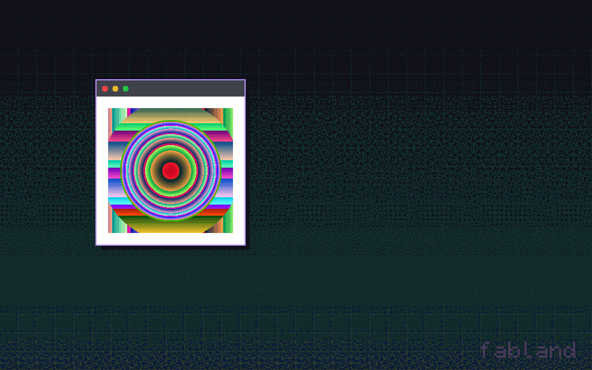
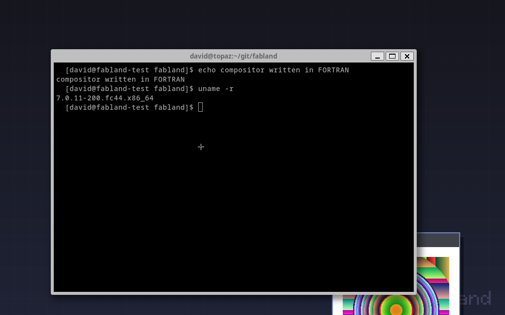

# fabland

**A Wayland compositor written in Fortran.** Almost certainly the first of its kind, for reasons that will be apparent to anyone who reads the source.



That's `weston-terminal` — a real, unmodified terminal emulator — running a live
bash session *inside* the Fortran compositor, with a `weston-simple-shm` window
being dragged around next to it. The compositor's monitor is your terminal
(truecolor half-blocks), and your keyboard and mouse are its seat.

No libwayland. No wlroots. No C helper code. fabland speaks the Wayland wire
protocol directly over a unix socket — `recvmsg`/`sendmsg` with `SCM_RIGHTS`
file-descriptor passing, `mmap`'d shared-memory pools, an XKB keymap generated
from scratch and served to clients over a `memfd` — reaching libc straight from
Fortran via `ISO_C_BINDING`.



## What it implements

| Protocol | Notes |
|---|---|
| `wl_display`, `wl_registry` | sync, delete_id, global advertisement + bind |
| `wl_compositor` / `wl_surface` | attach, damage, frame callbacks, commit |
| `wl_shm` / `wl_shm_pool` / `wl_buffer` | fd passing, mmap, resize, ARGB/XRGB8888 |
| `wl_seat` v7 | `wl_keyboard` (self-generated XKB keymap over memfd) + `wl_pointer` (motion, buttons, axis, frame) |
| `wl_output` | geometry, modes, scale |
| `wl_subcompositor` | subsurfaces composited onto their parent (foot's CSD uses these) |
| `wl_data_device_manager` | stubbed enough for toolkit clients |
| `xdg_wm_base` / `xdg_surface` / `xdg_toplevel` | configure/ack lifecycle, titles, close |

Window management: stacking order, click-to-focus/raise, focus-follows-map,
titlebar drag to move (ctrl+drag anywhere), close button, server-side
decorations with automatic CSD detection (clients that call
`set_window_geometry` are left to decorate themselves).

## Backends

**term** (default on a tty): the compositor renders its output into your
terminal as truecolor half-block cells and turns raw stdin + xterm SGR mouse
reporting into `wl_keyboard`/`wl_pointer` events. ASCII is bridged through a
US keymap, so anything you can type reaches the client — shells inside
terminals inside your terminal work fine. `F12` writes a PNG screenshot,
`F10` (or ctrl-alt-q) quits.

**headless** (default otherwise, or `FABLAND_BACKEND=headless`): PNG frames
only, written by a from-scratch PNG encoder (CRC-32, Adler-32, stored-deflate
— also Fortran).

## Build & run

```sh
make
./fabland                    # listens on $XDG_RUNTIME_DIR/fabland-0
```

Then, from anywhere that shares the runtime dir:

```sh
WAYLAND_DISPLAY=fabland-0 weston-terminal
WAYLAND_DISPLAY=fabland-0 foot
WAYLAND_DISPLAY=fabland-0 weston-simple-shm
```

Environment knobs: `FABLAND_DISPLAY` (socket name), `FABLAND_BACKEND`
(`term`/`headless`), `FABLAND_SHOT_EVERY` (write a PNG every N repaints),
`FABLAND_DEBUG` (log every request).

## What it is not

A daily driver. There is no DRM/KMS, no GPU, no damage tracking, no resize,
no copy-paste. It is, however, a genuine Wayland compositor that genuine
clients — including two real terminal emulators — are perfectly happy to talk
to, written in the language of numerical weather prediction and your
grandfather's linear algebra.

```
src/fl_libc.f90    libc bindings: sockets, poll, recvmsg/sendmsg + SCM_RIGHTS, mmap, memfd
src/fl_xkb.f90     XKB keymap generator + ASCII -> evdev bridge
src/fl_term.f90    terminal backend: half-block renderer, SGR mouse / key parser
src/fl_png.f90     dependency-free PNG encoder
src/fabland.f90    wire protocol, object registry, dispatch, WM, renderer
```

Written by Claude (Fable 5), from a one-shot challenge by [@davidar](https://github.com/davidar):
"a Wayland compositor in a language nobody has ever used for one before."
